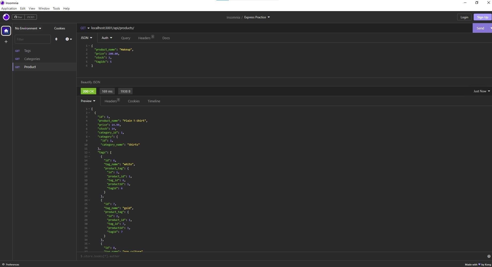
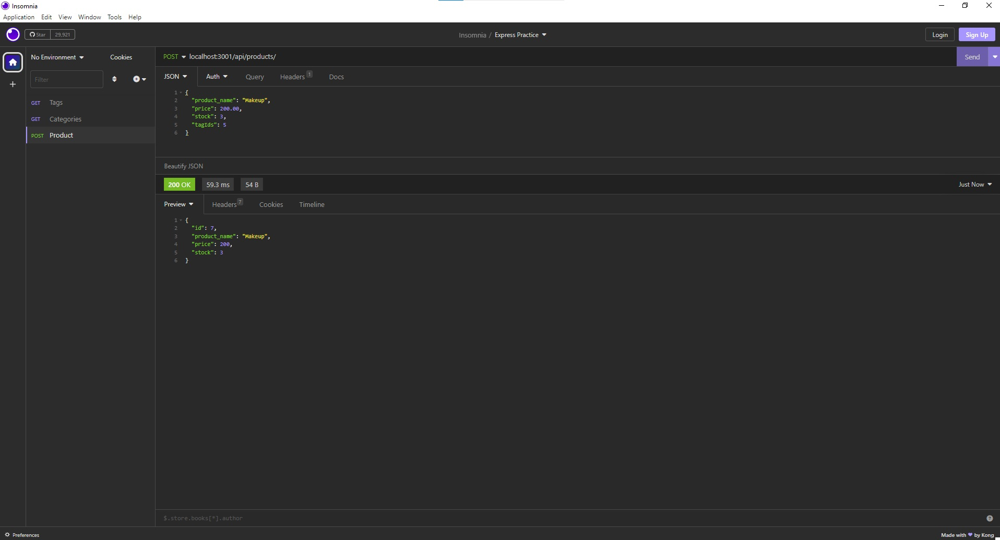
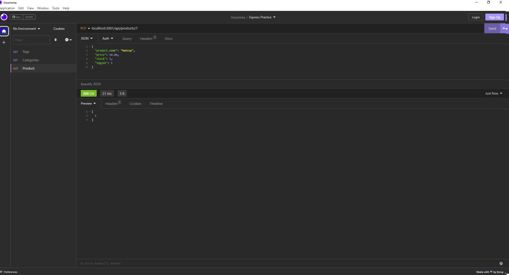

# e-commerce-back-end

## Description

This program allows you to look through the back end and see your products, tags, and categories. When viewing your products, tags, and categories, you'll be able to see the relationships that each thing has with each other. You'll also be able to post, update, and delete the products, tags, and categories based on your liking.

## Installation

You can install the e-commerce application on github here

https://github.com/Rockojoe2/e-commerce-back-end

You can view the video on how it functions here

https://drive.google.com/file/d/1kvDC6QmPbadW6DsOF_l3ShJNCBbhuyjT/view

## Credits
UTA class folder

Worked with classmates May Pham (https://github.com/mayphamx), Lucas Wysoczanski (https://github.com/LucasWyski001) Daniel Lee: (https://github.com/drog41813) and Mica Villanueva(https://github.com/micavilla) 

## License

MIT License

---